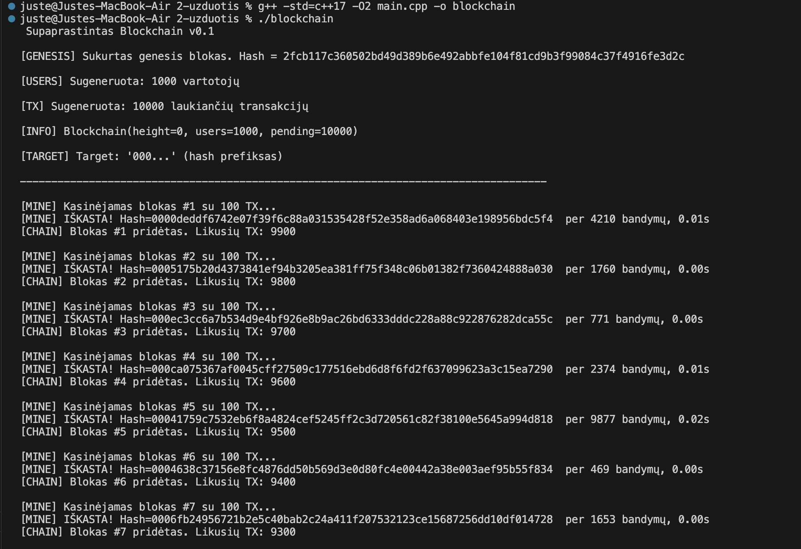
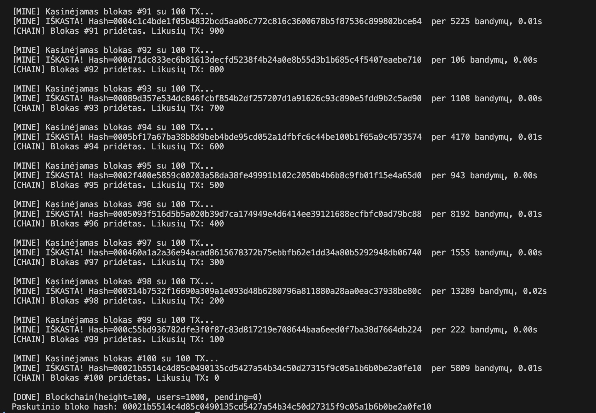

# 2-oji užduotis: Supaprastintos blokų grandinės (Blockchain) kūrimas. v0.1

--------------------------
Supaprastintas blockchain modelis parašytas C++.

-------------------------
**Kompiliuoti:** g++ -std=c++17 -O2 main.cpp -o blockchain <rm>

**Paleisti:** ./blockchain <rm>

--------------------------

## Struktūros ir klasės

**User** – saugo vartotojo duomenis: vardą, viešą raktą ir balansą.  
Naudojama vartotojų kūrimui ir balansų valdymui.

**Transaction** – aprašo vieną pervedimą tarp vartotojų.  
Turi siuntėją, gavėją, sumą ir automatiškai generuojamą `transaction_id` pagal hash.

**BlockHeader** – apima visą bloko antraštę: ankstesnio bloko hash, laiką, versiją, transakcijų hash, difficulty ir nonce.  
Metodas `to_string()` sujungia šiuos duomenis į tekstą, kuris vėliau hashuojamas.

**Block** – jungia `BlockHeader` ir transakcijų sąrašą.  
Metodas `compute_hash()` apskaičiuoja viso bloko hash ir naudojamas tikrinant vientisumą.

**Blockchain** – pagrindinė klasė valdanti visą sistemą.  
Atsakinga už:
- vartotojų ir transakcijų generavimą;
- blokų kūrimą ir kasimą naudojant kelis kandidatus (Proof-of-Work imitacija);
- Merkle Root apskaičiavimą kiekvienam blokui;
- transakcijų verifikaciją (balansų, ID, gavėjo ir siuntėjo tikrinimą);
- balansų atnaujinimą tik patvirtintoms transakcijoms;
- grandinės vientisumo palaikymą ir blokų sekos išsaugojimą.

--------------------------

## Veikimo eiga

1. **Sukuriamas genesis blokas**  
   Pirmasis blokas grandinėje. Jo `previous_hash` yra tik nuliai, nes prieš jį dar nieko nėra.  

2. **Sugeneruojami vartotojai**  
   Programa sukuria vartotojus su atsitiktiniais balansais ir unikaliu viešu raktu (`pk_...`).  
   Jie naudojami kaip siuntėjai ir gavėjai transakcijose.

3. **Generuojamos transakcijos**  
   Kiekviena transakcija turi:
   - siuntėją,
   - gavėją,
   - pervedamą sumą,
   - automatiškai sukurtą `transaction_id` (pagal hash).  
   Šios transakcijos patenka į „pending“ sąrašą.

4. **Sudaromi keli kandidatiniai blokai**  
   Iš laukiančių transakcijų suformuojami 5 skirtingi kandidatiniai blokai (~100 transakcijų kiekviename).  
   Kiekvienam kandidatui apskaičiuojamas **Merkle Root**, kuris įrašomas į `BlockHeader`.  

5. **Kasimas (Proof of Work)**  
   5 kandidatiniai blokai „lenktyniauja“ dėl tinkamo hash.  
   Programa paeiliui tikrina kiekvieną kandidatą (for ciklas) ribotą laiką (pvz. 5 s).  
   Kiekviename bandyme keičiamas `nonce`, kol kažkurio iš kandidatinių blokų hash prasideda simboliais `"000"`.  
   Jei per nustatytą laiką nė vienas kandidatas neranda tinkamo hash – laiko limitas padidinamas (`×1.5`) ir ciklas kartojamas.

6. **Transakcijų verifikacija**  
   Prieš pritaikant transakcijas tikrinama:  
   - ar siuntėjas ir gavėjas egzistuoja, 
   - ar `transaction_id` atitinka maišos reikšmę.  
   - ar siuntėjas turi pakankamai lėšų,  
   - ar siuntėjas nėra tas pats kaip gavėjas,  
   - ar suma teigiama,  
   Neteisingos transakcijos praleidžiamos.

7. **Bloko patvirtinimas ir įtraukimas į grandinę**  
   Radus tinkamą hash:
   - visos teisingos transakcijos pritaikomos (balansai atnaujinami);  
   - panaudotos transakcijos pašalinamos iš laukiančių;  
   - blokas pridedamas į grandinę.  

8. **Procesas kartojamas**  
   Kol dar liko laukiančių transakcijų – kasimas vykdomas toliau, kuriant naujus kandidatinius blokus ir tvirtinant juos į grandinę.

9. **Rezultatas**  
   Programa išveda informaciją apie iškastus blokus, jų hash reikšmes, `nonce`, kiek bandymų atlikta ir likusių transakcijų skaičių.  

--------------------------

**Screenshot'ai:**

Pradžia: <rm>

Pabaiga: <rm>

